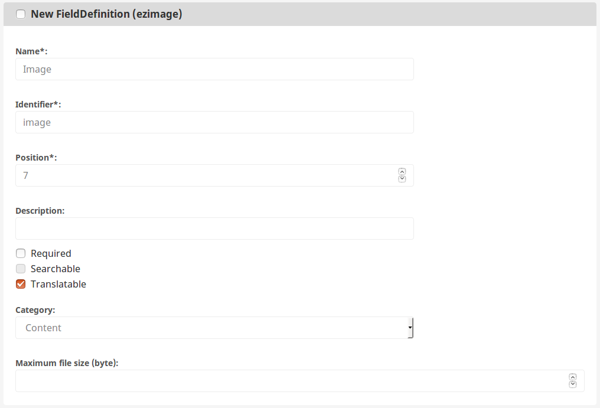
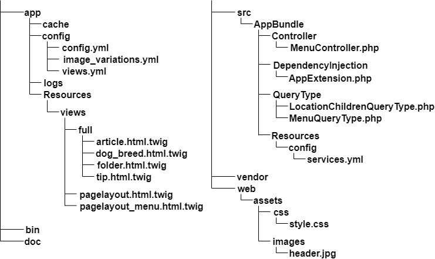

# Step 1 - Getting your starter website

!!! tip

    You can find all files used and modified in this step on [GitHub](https://github.com/ezsystems/ezstudio-beginner-tutorial/tree/step1).

To start working on the scenario of this tutorial, you need to have a minimal working website. You will be shown how to build it by hand from the ground up, starting with a clean eZ Enterprise installation. Just remember that if you decide to change anything from the way it is shown here, you will need to double-check all code that will be provided here and make sure it fits your website.

!!! note

    Remember to start working with a **clean** eZ Enterprise installation, **not** Studio Demo.

    To be able to follow all steps of the tutorial, make sure you are installing eZ Enterprise v1.7.0 or later v1 edition.

## Setting up the website

To set up your starter website by hand, you need to follow these steps:

### Get a clean eZ Enterprise installation

See [Install eZ Platform](../../getting_started/install_ez_platform.md) for a guide to installing eZ Enterprise.

### Create Content Types

Log in to the back office – add `/admin` to your installation's address (e.g. `tutorial.lh/admin`) and log in using `admin` as the login and `publish` as the password. In the Admin Panel go to Content types tab and (under the Content category) create two Content Types with the following settings:

#### Dog Breed

**Name:** Dog Breed

**Identifier:** dog\_breed

**Content name pattern:** &lt;name&gt;

**Fields:**

| Field Type | Name              | Identifier         | Required | Searchable | Translatable |
|------------|-------------------|--------------------|----------|------------|--------------|
| TextLine   | Name              | name               | Y        | Y          | Y            |
| TextLine   | Short Description | short\_description | Y        | Y          | Y            |
| Image      | Photo             | photo              | Y        |            |              |
| RichText   | Full Description  | description        | Y        | Y          | Y            |

#### Tip

**Name:** Tip

**Identifier:** tip

**Content name pattern:** &lt;title&gt;

**Fields:**

| Field Type | Name  | Identifier | Required | Searchable | Translatable |
|------------|-------|------------|----------|------------|--------------|
| TextLine   | Title | title      | Y        | Y          | Y            |
| TextBlock  | Body  | body       |          |            | Y            |

#### Modify existing Article Content Type

You also need to make one modification to the pre-existing Article content type also situated in the Content category (Admin Panel/Content types/Content). Edit this type by removing Image Field that has a Content Relation (ezobjectrelation) type, and creating a new Field in its place:

| Field Type | Name  | Identifier | Required | Searchable | Translatable |
|------------|-------|------------|----------|------------|--------------|
|   Image    | Image |   image    |          |            | Y            |



Now inserting photos into articles will be easier. Reaching the final result of the tutorial without this change would require you to spend more time creating content, which you want to avoid in this case.

### Add template, configuration and style files

Place the [`pagelayout.html.twig`](https://github.com/ezsystems/ezstudio-beginner-tutorial/blob/step1/app/Resources/views/pagelayout.html.twig) and [`pagelayout_menu.html.twig`](https://github.com/ezsystems/ezstudio-beginner-tutorial/blob/step1/app/Resources/views/pagelayout_menu.html.twig) files in `app/Resources/views` folder. Create a new folder, called `full`, under `views`. Place further template files in it:

- [`article.html.twig`](https://github.com/ezsystems/ezstudio-beginner-tutorial/blob/step1/app/Resources/views/full/article.html.twig)
- [`dog_breed.html.twig`](https://github.com/ezsystems/ezstudio-beginner-tutorial/blob/step1/app/Resources/views/full/dog_breed.html.twig)
- [`folder.html.twig`](https://github.com/ezsystems/ezstudio-beginner-tutorial/blob/step1/app/Resources/views/full/folder.html.twig)
- [`tip.html.twig`](https://github.com/ezsystems/ezstudio-beginner-tutorial/blob/step1/app/Resources/views/full/tip.html.twig)

Place two configuration files in `app/config` folder:

- [`views.yml`](https://github.com/ezsystems/ezstudio-beginner-tutorial/blob/step1/app/config/views.yml)
- [`image_variations.yml`](https://github.com/ezsystems/ezstudio-beginner-tutorial/blob/step1/app/config/image_variations.yml)

Modify the `config.yml` file located in `app/config` folder and add the following lines at the end of the `imports` block:

``` yaml
# in app/config/config.yml
    - { resource: views.yml }
    - { resource: image_variations.yml }
```

In `web/assets` folder create:

- a `css` subfolder and add this stylesheet file to it: [`style.css`](https://github.com/ezsystems/ezstudio-beginner-tutorial/blob/step1/web/assets/css/style.css)
- an `images` subfolder and add the [`header.jpg`](https://github.com/ezsystems/ezstudio-beginner-tutorial/blob/step1/web/assets/images/header.jpg) file to it

In `src/AppBundle` folder create a `QueryType` subfolder and add [`LocationChildrenQueryType.php`](https://github.com/ezsystems/ezplatform-ee-beginner-tutorial/blob/step1/src/AppBundle/QueryType/LocationChildrenQueryType.php) to it. This file allows your folders to display all content that they contain (read up on it [in the documentation](../../guide/content_rendering.md#query-controller)).

Finally, add the following files to `src/AppBundle`, to create dynamic links in the top menu:

- [`Controller/MenuController.php`](https://github.com/ezsystems/ezstudio-beginner-tutorial/blob/step1/src/AppBundle/Controller/MenuController.php)
- [`DependencyInjection/AppExtension.php`](https://github.com/ezsystems/ezstudio-beginner-tutorial/blob/step1/src/AppBundle/DependencyInjection/AppExtension.php)
- [`QueryType/MenuQueryType.php`](https://github.com/ezsystems/ezstudio-beginner-tutorial/blob/step1/src/AppBundle/QueryType/MenuQueryType.php)
- [`Resources/config/services.yml`](https://github.com/ezsystems/ezstudio-beginner-tutorial/blob/step1/src/AppBundle/Resources/config/services.yml)

All the files you've placed in `src/AppBundle` are not the scope of this tutorial and we won't go here into detail on how they work.

This is what the structure of the new and modified files should look like (excluding pre-existing files):



### Create content

Now return to the back office and create some content for your website.

First, make three Folders under the `Content/Content structure` tab. Call them 'All Articles', 'Dog Breed Catalog' and 'All Tips'. Remember that you save and close them by using 'Publish' button.

Next, create a few Content items of proper Content Types in each of these folders:

- 6 Articles (at least, to best see the effects of Schedule blocks that we will create in step 3.)
- 3 Dog Breeds
- 3 Tips

#### Add images

When you need an image, preferably use one from [this image pack](img/photos.zip), this will let you compare effects of your work to screenshots in the tutorial.

At this point you are ready to proceed with the next step.
