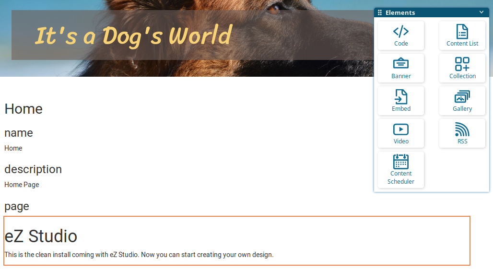
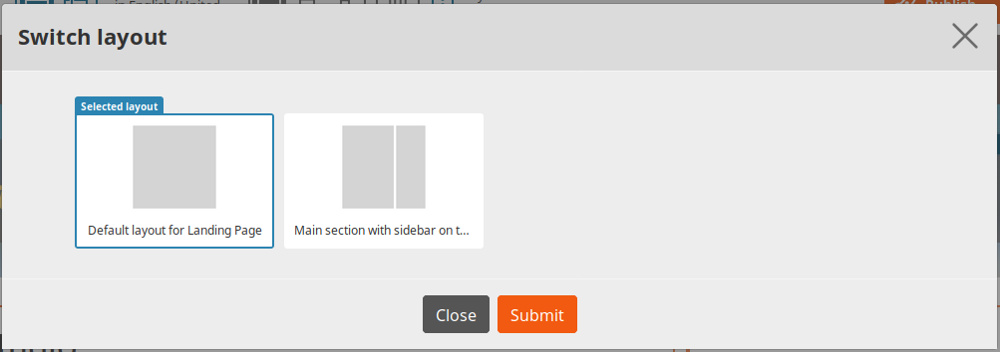

# Step 2 - Preparing the Landing Page

!!! tip

    You can find all files used and modified in this step on [GitHub](https://github.com/ezsystems/ezstudio-beginner-tutorial/tree/step2).

In this step you'll prepare and configure your front page, together with its layout and templates.

### Create Landing Page layout

If at this point you view the website from the front end, you will see that the home page looks quite unfinished. (You can, however, still use the menu and look around the existing content in the website).


!!! tip

    At any point in the tutorial if you don't see the results of your last actions when viewing the page, try clearing the cache and regenerating assets:

    `php bin/console cache:clear`

    `php bin/console assets:install`

Log in to the back office. Go to the `Content/Content Structure` where you will find Home item. It is the first page that is shown to the visitor. There you can check what Content Type it belongs to: it is a Landing Page.


The page contains only one simple Tag block and is displayed without any template. Now, switch to the StudioUI by going to the Page tab and click Edit. You can see here that the Home Landing Page has only one zone with the block.



As you saw in the final result screenshot, you need a layout with two zones: a main column and a narrower sidebar. eZ Enterprise provides only a one-zone default layout so you will need to create a new one.

!!! note

    It is not possible to change the layout of a Landing Page once it has been published. This means that after preparing the new layout you will have to create a completely new Landing Page, replace the current Home with it and delete the old one.

Preparing a new layout requires three things:

- **entry in configuration**
- **thumbnail** 
- **template** 

#### Create entry in configuration

First create a new file that will house layout configuration (and the configs for any other layouts you may want to create in future):

``` yaml
# app/config/layouts.yml
ez_systems_landing_page_field_type:
    layouts:
        sidebar:
            identifier: sidebar
            name: Right sidebar
            description: Main section with sidebar on the right
            thumbnail: assets/images/layouts/sidebar.png
            template: layouts/sidebar.html.twig
            zones:
                first:
                    name: First zone
                second:
                    name: Second zone
```

Creating the file is not enough, you also need to tell the app to read and use it. Add the following line to the `config.yml` file located in `app/config`, at the end of the `imports` block:

``` yaml
# in app/config/config.yml
  - { resource: layouts.yml }
```

!!! tip

    You could alternatively place the whole `layouts` configuration block directly inside `ezplatform.yml`. However, for clarity configs will be kept in separate files in this tutorial.

#### Add thumbnail

Take a look at the most important things that this configuration defines (for a detailed description of creating a Landing Page layout, see [Creating Landing Page layouts (Enterprise)](../../cookbook/creating_landing_page_layouts_(enterprise)):

The `sidebar` is the key of the layout, but it is the `name` that is displayed in the interface when the user selects a layout. The `thumbnail` links to an image file with an icon of the layout. It will also be shown when creating a new Landing Page, as a visual hint next to the name. Use the [supplied thumbnail file](https://github.com/ezsystems/ezstudio-beginner-tutorial/blob/step2/web/assets/images/layouts/sidebar.png) and place it in the `web/assets/images/layouts/` folder.

The `template` points to the twig file where in the next step you will create the template for this layout. This is the most important part of the configuration, as templates are what distinguishes all layouts from one another.

#### Create Landing Page template

Configuration points to `sidebar.html.twig` as the template for the layout. Let's create it and fill it in. Go to `app/Resources/views`. You can already see here some templates that define the looks of the existing parts of the website. Create a `layouts` folder and add the following file inside it:

``` html
<!--app/Resources/views/layouts/sidebar.html.twig-->
<div data-studio-zones-container>
    <main class="landing-page__zone landing-page__zone--{{ zones[0].id }} landing-page__zone--left col-xs-8" data-studio-zone="{{ zones[0].id }}">
        
            
                <div class="landing-page__block block_{{ block.type }}">
                    {{ render_esi(controller('ez_block:renderBlockAction', {
                        'contentId': contentInfo.id,
                        'blockId': block.id,
                        'versionNo': versionInfo.versionNo
                    })) }}
                </div>
            
        
    </main>
    <aside class="landing-page__zone landing-page__zone--{{ zones[1].id }} landing-page__zone--left col-xs-4" data-studio-zone="{{ zones[1].id }}">
        
            
                <div class="landing-page__block block_{{ block.type }}">
                    {{ render_esi(controller('ez_block:renderBlockAction', {
                        'contentId': contentInfo.id,
                        'blockId': block.id,
                        'versionNo': versionInfo.versionNo
                    })) }}
                </div>
            
        
    </aside>
</div>
```

The above template creates two columns and defines their widths. Each column is at the same time a zone, and each zone renders the blocks that it contains.

!!! tip

    In more complex setups with multiple different layouts you might want to consider separating the rendering of zones into a separate `zone.html.twig` template to avoid repeating the same code in every layout.

!!! note

    Layout templates can be configured and adapted in any way you like, like all other templates in eZ Platform. However, for a layout to work together with a Landing Page, the zone **must have** the `data-studio-zone` attribute (line 2 and 15), and the zone container **requires** the `data-studio-zones-container` attribute (line 1) to allow dropping Content into zones.

With these three elements: configuration, thumbnail and template, your new layout is ready to use.


### Create a Landing Page

Now you can create your Landing Page with the new layout to see the effects of your work. Do it as a child of the Home Content item (that is, go to StudioUI, click Create and select a Landing Page) – you will replace Home with this new Landing Page. Choose the new layout called "Right Sidebar" and name the new page "Front Page". The empty zones as you have defined them will be visible in the editor.



If the new layout is not available when creating a new Landing Page, you may need to clear the cache (using `php bin/console cache:clear`) and/or reload the app.

Once you publish, you will notice that the Landing Page hasn't changed. This is because the looks of a Landing Page are actually defined in two separate template files, and you have only prepared one of those. Our `sidebar.html.twig` file defines how zones are organized and governs the display of zone's content. But one more general template file is needed. It will be used for every Landing Page, regardless of its layout. Because you haven't created it yet, the page is displayed using default settings.

Correct this by creating a `landing_page.html.twig` template in `app/Resources/views/full/` folder:

``` html
<!--app/Resources/views/full/landing_page.html.twig-->



    <div class="col-md-12">
        {{ ez_render_field(content, 'page') }}
    </div>

```

As you can see, above file simply renders the page content. If there is any additional content or formatting you would like to apply to every Landing Page, it should be placed in this template.

Now you need to tell the app to use this template whenever it tries to render a Landing Page. Edit the `views.yml` file in `app/config` and add the following code under `full:` key. You can place this block anywhere before or after other view configuration blocks (folder, article etc.) but remember that the indentations must match:

``` yaml
# in app/config/views.yml
landing_page:
    template: "full/landing_page.html.twig"
    match:
        Identifier\ContentType: "landing_page"
```


!!! note

    The `views.yml` file already contains a handful of view config blocks, and the `views/full` folder has templates that correspond to them. They are used to render the existing content you have in your website - articles, dog breed information and tips. In a clean installation these configurations and the folder would not exist and you would have to build all view templates from scratch.

After adding this template you can check your new Landing Page. The part between menu and footer should be empty, because you have not added any actual content to it yet.


Until the Front Page is swapped with the current Home, you can access the new page by adding `/Front-Page` to the URI address.

### Replacing the front page

Now let's replace the current Home with your new Front Page.

To swap these two Content items, go to Home in back office (if you are in the StudioUI, switch by clicking Content at the top). Open the Locations tab, click Select Content Item under Content Location Swap and select the newly created Front Page. The two pages should now be swapped, with the new Landing Page becoming the first item in the Content tree. It will now be the first page that visitors will see. In the next step you will fill it up with the content.

You can now delete the previous Home page, as you don't need it anymore. Navigate to it in the Content mode and click Send to Trash in the menu on the right.

 
